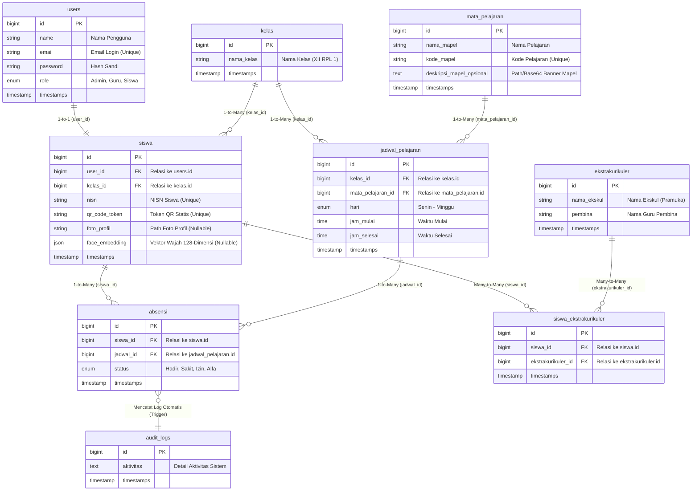

# DOKUMENTASI STRUKTUR DATABASE LENGKAP: EDUATTEND (SI-ABSEN-QR)

Dokumen ini menjelaskan rancangan basis data (**Database Schema**), relasi antar tabel, tipe data, serta implementasi logika tingkat lanjut database (*Stored Procedure* dan *Trigger*) pada sistem **EduAttend**. Dokumentasi ini sangat berguna untuk mempermudah penjelasan bab **Perancangan Basis Data / ERD** di laporan proyek akhir atau skripsi Anda.

---

## 📊 1. ENTITY RELATIONSHIP DIAGRAM (ERD)

Berikut adalah visualisasi hubungan antar entitas database pada aplikasi EduAttend:



---

## 📝 2. RINCIAN TABEL & SKEMA MIGRASI

### A. Tabel Autentikasi & Pengguna
1.  **`users` (Akun Pengguna)**
    *   `id` (BigInt, Primary Key, Auto Increment)
    *   `name` (Varchar 255): Nama lengkap admin, guru, atau siswa.
    *   `email` (Varchar 255, Unique): Digunakan untuk login ke sistem.
    *   `password` (Varchar 255): Hash kata sandi pengguna (BCrypt).
    *   `role` (Enum: `'Admin'`, `'Guru'`, `'Siswa'`): Menentukan hak akses di sistem.
2.  **`siswa` (Profil Siswa)**
    *   `id` (BigInt, Primary Key, Auto Increment)
    *   `user_id` (BigInt, Foreign Key -> `users.id`): Menghubungkan siswa dengan akun login-nya. Menggunakan aksi `ON DELETE CASCADE`.
    *   `kelas_id` (BigInt, Foreign Key -> `kelas.id`): Menunjukkan kelas aktif siswa. Menggunakan aksi `ON DELETE CASCADE`.
    *   `nisn` (Varchar 255, Unique): Nomor Induk Siswa Nasional.
    *   `qr_code_token` (Varchar 255, Unique): Token statis acak untuk pencarian data siswa saat scan QR Code.
    *   `foto_profil` (Varchar 255, Nullable): Path penyimpanan foto profil.
    *   `face_embedding` (JSON, Nullable): Array 128 angka desimal yang merepresentasikan struktur biologis wajah untuk verifikasi Face ID.

### B. Tabel Akademik & Kelas
3.  **`kelas` (Data Kelas)**
    *   `id` (BigInt, Primary Key, Auto Increment)
    *   `nama_kelas` (Varchar 255): Nama kelas (contoh: "XII RPL 1", "X IPA 2").
4.  **`mata_pelajaran` (Mata Pelajaran)**
    *   `id` (BigInt, Primary Key, Auto Increment)
    *   `nama_mapel` (Varchar 255): Nama mata pelajaran (contoh: "Pemrograman Web").
    *   `kode_mapel` (Varchar 255, Unique): Kode mata pelajaran (contoh: "PW001").
    *   `deskripsi_mapel_opsional` (Text, Nullable): Path file gambar banner pengumuman untuk mapel tersebut.
5.  **`jadwal_pelajaran` (Jadwal Pelajaran)**
    *   `id` (BigInt, Primary Key, Auto Increment)
    *   `kelas_id` (BigInt, Foreign Key -> `kelas.id`): Kelas sasaran mata pelajaran.
    *   `mata_pelajaran_id` (BigInt, Foreign Key -> `mata_pelajaran.id`): Mata pelajaran yang diajarkan.
    *   `hari` (Enum: `'Senin'`, `'Selasa'`, `'Rabu'`, `'Kamis'`, `'Jumat'`, `'Sabtu'`, `'Minggu'`).
    *   `jam_mulai` (Time): Waktu jam masuk kelas (contoh: `08:00:00`).
    *   `jam_selesai` (Time): Waktu jam selesai kelas (contoh: `10:00:00`).

### C. Tabel Kehadiran & Audit Log
6.  **`absensi` (Catatan Kehadiran)**
    *   `id` (BigInt, Primary Key, Auto Increment)
    *   `siswa_id` (BigInt, Foreign Key -> `siswa.id`): Identitas siswa yang hadir.
    *   `jadwal_id` (BigInt, Foreign Key -> `jadwal_pelajaran.id`): Jadwal kelas yang dihadiri.
    *   `status` (Enum: `'Hadir'`, `'Sakit'`, `'Izin'`, `'Alfa'`). Default bernilai `'Hadir'`.
7.  **`audit_logs` (Sistem Log Keamanan)**
    *   `id` (BigInt, Primary Key, Auto Increment)
    *   `aktivitas` (Text): Catatan peristiwa yang terjadi (contoh: "Siswa ID 1 Sukses Scan Absen.").

### D. Tabel Kegiatan Ekstrakurikuler (Many-to-Many)
8.  **`ekstrakurikuler` (Data Ekstrakurikuler)**
    *   `id` (BigInt, Primary Key, Auto Increment)
    *   `nama_ekskul` (Varchar 255): Nama kegiatan (contoh: "Pramuka", "Basket").
    *   `pembina` (Varchar 255): Nama guru pembina ekstrakurikuler.
9.  **`siswa_ekstrakurikuler` (Tabel Pivot Relasi)**
    *   `id` (BigInt, Primary Key, Auto Increment)
    *   `siswa_id` (BigInt, Foreign Key -> `siswa.id`): Menghubungkan ke profil siswa.
    *   `ekstrakurikuler_id` (BigInt, Foreign Key -> `ekstrakurikuler.id`): Menghubungkan ke ekstrakurikuler.

---

## ⚙️ 3. PROSEDUR & TRIGGER DI TINGKAT DATABASE

Aplikasi ini menggunakan optimasi di tingkat basis data MySQL untuk menjaga performa operasional tetap optimal.

### A. MySQL Stored Procedure: `sp_catat_absen_qr`
*   **Fungsi:** Menerima parameter Token QR, Jadwal ID, dan Status Kehadiran. Stored procedure mencari baris data siswa yang memiliki token tersebut, mendapatkan `siswa.id`, lalu menyisipkannya langsung ke tabel `absensi`.
*   **Skema SQL:**
    ```sql
    CREATE PROCEDURE sp_catat_absen_qr(
        IN p_token VARCHAR(255), 
        IN p_jadwal_id INT, 
        IN p_status VARCHAR(10)
    )
    BEGIN
        DECLARE v_siswa_id INT;
        
        -- Mencari ID siswa berdasarkan token QR statis
        SELECT id INTO v_siswa_id FROM siswa WHERE qr_code_token = p_token LIMIT 1;
        
        -- Menyisipkan baris kehadiran jika siswa ditemukan
        IF v_siswa_id IS NOT NULL THEN
            INSERT INTO absensi (siswa_id, jadwal_id, status, created_at, updated_at) 
            VALUES (v_siswa_id, p_jadwal_id, p_status, NOW(), NOW());
        END IF;
    END
    ```

### B. MySQL Trigger: `tr_after_insert_absensi`
*   **Fungsi:** Berjalan otomatis sesaat setelah absensi berhasil dimasukkan ke tabel `absensi`. Trigger ini langsung menyisipkan catatan peristiwa baru ke dalam tabel `audit_logs` untuk audit logging sistem yang aman (*tamper-proof*).
*   **Skema SQL:**
    ```sql
    CREATE TRIGGER tr_after_insert_absensi
    AFTER INSERT ON absensi FOR EACH ROW
    BEGIN
        INSERT INTO audit_logs (aktivitas, created_at, updated_at) 
        VALUES (CONCAT('Siswa ID ', NEW.siswa_id, ' Sukses Scan Absen.'), NOW(), NOW());
    END
    ```

---

## ❓ PERTANYAAN DOSEN PENGUJI YANG SERING MUNCUL

1.  **Mengapa struktur relasi `users` dan `siswa` dipisah menjadi 2 tabel?**
    *   *Jawaban:* Menggunakan prinsip **Normalisasi Basis Data**. Tabel `users` hanya fokus menangani proses autentikasi sistem (Login/Register) secara umum untuk seluruh peran (Admin, Guru, Siswa). Sedangkan tabel `siswa` menyimpan atribut detail spesifik profil siswa (NISN, kelas, koordinat wajah, token QR). Hal ini meminimalkan redundansi data jika nanti ada profil terpisah untuk Guru.
2.  **Kenapa data koordinat wajah disimpan sebagai tipe `JSON` di database?**
    *   *Jawaban:* Pustaka `face-api.js` mendeteksi wajah dalam bentuk array berdimensi 128 (berisi angka pecahan/float). Format `JSON` adalah cara paling efisien dan fleksibel untuk menyimpan array array di MySQL tanpa perlu membuat 128 kolom terpisah di database.
3.  **Apa keuntungan relasi `siswa` dan `ekstrakurikuler` menggunakan tabel pivot?**
    *   *Jawaban:* Relasi tersebut adalah hubungan **Many-to-Many** (satu siswa dapat mengikuti banyak ekskul, dan satu ekskul diikuti banyak siswa). Tabel pivot `siswa_ekstrakurikuler` menjadi penghubung yang menjembatani hubungan Many-to-Many tersebut dengan mereferensikan foreign key dari kedua tabel utama.
