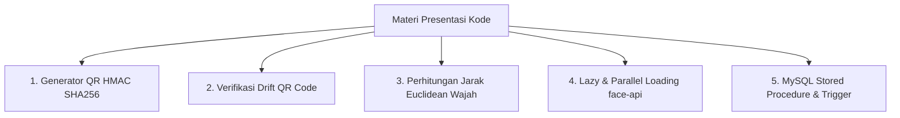

# KODE PROGRAM TERPENTING UNTUK PRESENTASI (CONTEKAN DOSEN PENGUJI)

Dokumen ini berisi daftar bagian kode program paling krusial dari aplikasi **EduAttend (SI-ABSEN-QR)**. Tampilkan dan jelaskan bagian-bagian ini saat Anda melakukan demo aplikasi di hadapan dosen penguji, karena bagian inilah yang memiliki bobot akademis dan nilai keamanan tertinggi.

---

## 🎯 DAFTAR KODE PROGRAM YANG WAJIB DITAMPILKAN



---

## 1. Pembuatan Dynamic QR Code Berbasis HMAC-SHA256 & Waktu (Server-Side)
*   **File:** [routes/web.php](file:///c:/laragon/www/si-absen-qr/routes/web.php#L36-L40)
*   **Cuplikan Kode:**
    ```php
    $timeWindow = floor(time() / 15); // Berubah otomatis tiap 15 detik
    $hash = substr(hash_hmac('sha256', $jadwal->id . '|' . $timeWindow, config('app.key')), 0, 16);
    $payload = $jadwal->id . '|' . $timeWindow . '|' . $hash;
    ```
*   **Kenapa ini penting?** 
    Siswa tidak bisa mengambil foto screenshot QR Code lalu menyebarkannya ke teman di luar kelas, karena dalam 15 detik QR tersebut sudah tidak berlaku.
*   **Pertanyaan Dosen:** *"Bagaimana cara sistem memastikan QR Code tidak bisa dibuat sendiri secara manual oleh siswa?"*
*   **Jawaban:** *"QR Code ditandatangani secara digital menggunakan fungsi `hash_hmac` dengan algoritma `SHA256` menggunakan kunci rahasia aplikasi (`APP_KEY` Laravel) yang hanya diketahui oleh server. Jika siswa mencoba merekayasa QR sendiri, tanda tangannya pasti tidak akan cocok saat diverifikasi."*

---

## 2. Validasi & Verifikasi QR Code Dinamis (Client-to-Server)
*   **File:** [PortalSiswa.php](file:///c:/laragon/www/si-absen-qr/app/Livewire/PortalSiswa.php#L90-L112)
*   **Cuplikan Kode:**
    ```php
    // 1. Validasi Tanda Tangan (Signature)
    $expectedHash = substr(hash_hmac('sha256', $jadwalId . '|' . $timeWindow, config('app.key')), 0, 16);
    if (!hash_equals($expectedHash, $hash)) {
        $this->errorMessage = 'QR Code tidak valid (tanda tangan tidak cocok).';
        return;
    }

    // 2. Validasi Kedaluwarsa (Maksimal selisih 2 jendela / 30 detik untuk delay internet)
    $currentWindow = floor(time() / 15);
    $diff = $currentWindow - $timeWindow;
    if ($diff < 0 || $diff > 2) {
        $this->errorMessage = 'QR Code sudah kedaluwarsa.';
        return;
    }
    ```
*   **Kenapa ini penting?**
    Menunjukkan pengujian keamanan waktu (*time drift security*). Menggunakan `hash_equals()` untuk menghindari serangan *Timing Attack*.
*   **Pertanyaan Dosen:** *"Bagaimana jika jaringan internet siswa lambat saat scan? Apakah langsung gagal?"*
*   **Jawaban:** *"Sistem memberikan toleransi keterlambatan sebesar 2 jendela waktu (maksimal 30 detik lag). Jika waktu pemindaian masih dalam rentang waktu tersebut, absensi tetap diterima untuk memaklumi masalah latensi jaringan."*

---

## 3. Algoritma Euclidean Distance untuk Pencocokan Face ID (Matematika / AI)
*   **File:** [PortalSiswa.php](file:///c:/laragon/www/si-absen-qr/app/Livewire/PortalSiswa.php#L261-L276)
*   **Cuplikan Kode:**
    ```php
    private function calculateEuclideanDistance($registered, $scanned)
    {
        $registered = is_string($registered) ? json_decode($registered, true) : $registered;
        $scanned = is_string($scanned) ? json_decode($scanned, true) : $scanned;

        $sum = 0.0;
        foreach ($registered as $i => $val) {
            $diff = $val - $scanned[$i];
            $sum += $diff * $diff;
        }
        return sqrt($sum);
    }
    ```
*   **Kenapa ini penting?**
    Inilah inti akademis pengenalan wajah. Menghitung jarak geometris antara vektor wajah terdaftar dan wajah pemindai di ruang 128-dimensi.
*   **Pertanyaan Dosen:** *"Bagaimana cara sistem menentukan wajah tersebut cocok atau tidak?"*
*   **Jawaban:** *"Wajah diubah menjadi 128 angka desimal (vektor embedding). Kami menghitung jarak Euclidean dari kedua vektor tersebut. Jika jaraknya $\le 0.6$, artinya wajah sangat mirip dan dinyatakan cocok. Jika $> 0.6$, wajah dinyatakan tidak cocok dan absensi ditolak."*

---

## 4. Lazy Loading & Parallel Model Loading face-api.js (Frontend Performance)
*   **File:** [portal-siswa.blade.php](file:///c:/laragon/www/si-absen-qr/resources/views/livewire/portal-siswa.blade.php#L93-L129)
*   **Cuplikan Kode:**
    ```javascript
    window.__loadFaceModels = async function() {
        if (window.__faceModelsLoaded) return;
        await window.__loadFaceApi();
        const CDN_URL = 'https://cdn.jsdelivr.net/npm/@vladmandic/face-api/model/';
        await Promise.all([
            faceapi.nets.tinyFaceDetector.loadFromUri(CDN_URL),
            faceapi.nets.faceLandmark68TinyNet.loadFromUri(CDN_URL),
            faceapi.nets.faceRecognitionNet.loadFromUri(CDN_URL)
        ]);
        window.__faceModelsLoaded = true;
    };
    ```
*   **Kenapa ini penting?**
    Menunjukkan keahlian Anda dalam optimasi performa web.
*   **Pertanyaan Dosen:** *"Kenapa aplikasi tidak lambat saat pertama kali dibuka, padahal memuat model AI TensorFlow yang berat?"*
*   **Jawaban:** *"Kami menggunakan **Lazy Loading**; pustaka TensorFlow baru dimuat ketika pengguna menekan tombol daftar/scan. Kami juga menggunakan **Promise.all** agar ketiga file model AI diunduh secara paralel/bersamaan, serta melakukan caching global `window.__faceModelsLoaded` agar saat modal dibuka kedua kalinya tidak perlu mengunduh ulang model."*

---

## 5. MySQL Stored Procedure untuk Kecepatan Transaksi Absensi
*   **File:** [2026_06_05_161007_create_stored_procedures_and_triggers_table.php](file:///c:/laragon/www/si-absen-qr/database/migrations/2026_06_05_161007_create_stored_procedures_and_triggers_table.php#L28-L38)
*   **Cuplikan Kode:**
    ```sql
    CREATE PROCEDURE sp_catat_absen_qr(
        IN p_token VARCHAR(255), 
        IN p_jadwal_id INT, 
        IN p_status VARCHAR(10)
    )
    BEGIN
        DECLARE v_siswa_id INT;
        SELECT id INTO v_siswa_id FROM siswa WHERE qr_code_token = p_token LIMIT 1;
        IF v_siswa_id IS NOT NULL THEN
            INSERT INTO absensi (siswa_id, jadwal_id, status, created_at, updated_at) 
            VALUES (v_siswa_id, p_jadwal_id, p_status, NOW(), NOW());
        END IF;
    END
    ```
*   **Kenapa ini penting?**
    Menunjukkan penguasaan fitur DBMS tingkat lanjut (bukan hanya CRUD Eloquent ORM biasa).
*   **Pertanyaan Dosen:** *"Kenapa pencatatan absensi ditaruh di Stored Procedure, bukan query biasa di Laravel?"*
*   **Jawaban:** *"Untuk mengoptimalkan performa database. Query pencarian ID siswa berdasarkan token QR dan proses penyisipan baris absensi digabungkan langsung di tingkat DBMS. Hal ini mengurangi round-trip komunikasi antara server PHP dan MySQL, sehingga proses absensi menjadi sangat cepat."*

---

## 6. MySQL Trigger untuk Audit Logs Otomatis (Database Integrity)
*   **File:** [2026_06_05_161007_create_stored_procedures_and_triggers_table.php](file:///c:/laragon/www/si-absen-qr/database/migrations/2026_06_05_161007_create_stored_procedures_and_triggers_table.php#L52-L59)
*   **Cuplikan Kode:**
    ```sql
    CREATE TRIGGER tr_after_insert_absensi
    AFTER INSERT ON absensi FOR EACH ROW
    BEGIN
        INSERT INTO audit_logs (aktivitas, created_at, updated_at) 
        VALUES (CONCAT('Siswa ID ', NEW.siswa_id, ' Sukses Scan Absen.'), NOW(), NOW());
    END
    ```
*   **Kenapa ini penting?**
    Menunjukkan sistem log keamanan yang terintegrasi di database (*tamper-proof*).
*   **Pertanyaan Dosen:** *"Bagaimana Anda menjamin log audit keamanan tidak bisa dilewati jika ada yang memasukkan data langsung ke database?"*
*   **Jawaban:** *"Kami menggunakan **Database Trigger** `AFTER INSERT`. Setiap kali ada baris data baru yang masuk ke tabel `absensi` (baik diinput melalui Laravel, admin panel, maupun injeksi query manual), trigger di DBMS akan langsung mencatat log audit ke tabel `audit_logs` secara otomatis."*
