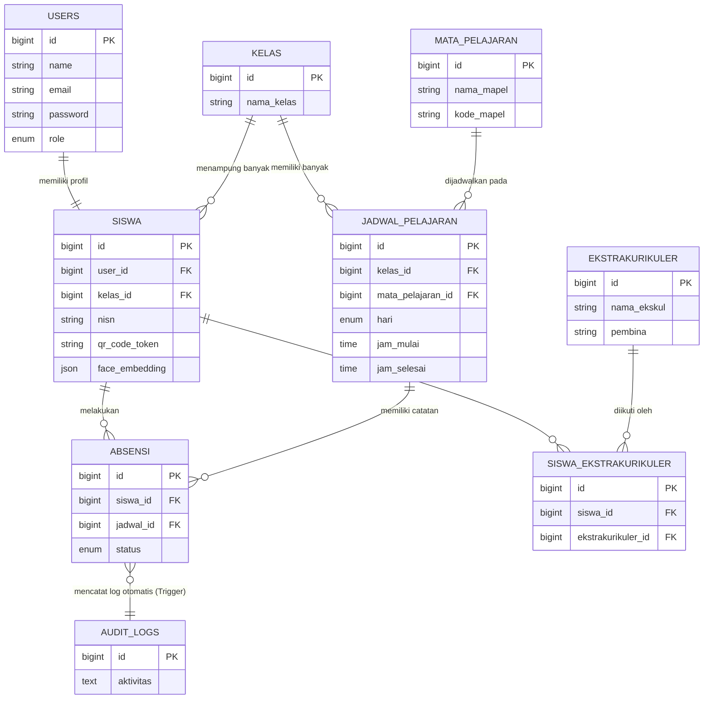

# DRAF & MATERI LAPORAN PROYEK: SISTEM ABSENSI SMART - EDUATTEND (SI-ABSEN-QR)

Dokumen ini berisi draf panduan, materi, penjelasan struktur, basis data, relasi, MVC, serta analisis kode yang sangat lengkap dan terstruktur. Dokumen ini dirancang khusus untuk mempermudah penyusunan laporan proyek akhir pemrograman web.

---

## 1. PENDAHULUAN & DESKRIPSI SISTEM
**EduAttend (SI-ABSEN-QR)** adalah sistem absensi berbasis web yang dirancang khusus untuk lingkungan sekolah/kampus guna meminimalisir kecurangan absensi (seperti penitipan absen/QR sharing). Sistem ini mengintegrasikan dua tingkat verifikasi keamanan utama:
1. **Dynamic QR Code (QR Code Dinamis):** Kode QR yang ditampilkan oleh guru di kelas memiliki tanda tangan keamanan (HMAC) berbasis waktu dan hanya berlaku selama **15–30 detik** sebelum berganti secara otomatis.
2. **Face ID Verification (Verifikasi Wajah):** Setelah siswa memindai QR Code, sistem akan mencocokkan wajah siswa secara langsung (real-time) melalui kamera depan menggunakan pustaka **face-api.js** berbasis TensorFlow.js. Kecocokan dihitung dengan algoritma matematis **Euclidean Distance** (ambang batas jarak $\le 0.6$).

Sistem juga dilengkapi dengan **Panel Admin & Guru** berbasis **Filament v3** untuk mengelola data master (siswa, kelas, mata pelajaran, jadwal) serta memantau log aktivitas secara komprehensif.

---

## 2. TEKNOLOGI STACK (APA YANG DIGUNAKAN?)

Aplikasi ini dibangun menggunakan arsitektur modern dengan pustaka-pustaka berikut:

### A. Backend & Framework Utama
- **Laravel 11.x (PHP 8.2+):** Framework utama untuk manajemen routing, database migration, model relasional (Eloquent ORM), autentikasi sesi, dan manajemen backend.
- **Filament PHP v3:** Framework panel administrasi berbasis TALL Stack (Tailwind, Alpine, Livewire, Laravel) untuk mempermudah pembuatan panel manajemen Admin & Guru secara instan dan aman.

### B. Frontend Reaktif
- **Livewire v3:** Framework full-stack Laravel yang memungkinkan pembuatan komponen antarmuka dinamis dan reaktif tanpa menulis banyak Javascript manual. Livewire mengelola pertukaran data backend-frontend secara seamless melalui AJAX/WebSockets buatan.
- **Alpine.js v3:** Framework Javascript mikro yang berjalan di sisi klien (browser) untuk mengelola status UI (seperti pembukaan modal, status stream kamera, status loading modal, dan tab active).
- **Tailwind CSS:** Utility-first CSS framework untuk menghasilkan antarmuka premium, bersih, responsif (mobile-friendly), dan modern.

### C. Basis Data (Database)
- **MySQL / MariaDB:** Database relasional utama yang digunakan di production. Menggunakan fitur lanjutan seperti **Stored Procedures** untuk pencatatan absensi yang cepat dan aman, serta **Database Triggers** untuk audit logging aktivitas sistem otomatis.
- **SQLite:** Digunakan sebagai database in-memory saat menjalankan **Automated Feature Testing (PHPUnit)** untuk memastikan integritas logika kode tetap aman tanpa merusak database utama.

### D. Pustaka Pihak Ketiga (Libraries & APIs)
- **face-api.js (oleh Vlad Mandic / TensorFlow.js):** Pustaka berbasis kecerdasan buatan (AI) yang berjalan sepenuhnya di sisi browser (client-side) untuk mendeteksi wajah, melacak koordinat wajah (facial landmarks), dan menghasilkan **128-dimensional face descriptor vector (embedding)**.
- **html5-qrcode:** Pustaka Javascript yang sangat ringan untuk membaca barcode/QR Code langsung melalui kamera perangkat di mobile maupun desktop.
- **SimpleSoftwareIO/QrCode (BaconQrCode):** Wrapper Laravel untuk memproduksi SVG QR Code dinamis dari sisi server.

---

## 3. STRUKTUR DIREKTORI PROYEK (FOLDER STRUCTURE)

Berikut adalah struktur folder utama dari proyek **SI-ABSEN-QR** beserta fungsinya:

```text
si-absen-qr/
├── app/
│   ├── Filament/                <-- Panel Admin & Guru (Filament v3)
│   │   ├── Resources/           <-- Manajemen data master (User, Siswa, Kelas, Absen, dll)
│   │   └── Pages/               <-- Halaman kustom panel admin
│   ├── Http/
│   │   └── Controllers/
│   │       └── AuthController.php <-- Logika Login, Register, Logout (Siswa & Admin)
│   ├── Livewire/
│   │   └── PortalSiswa.php      <-- Kontroler utama Portal Siswa (Scan QR & Face ID)
│   └── Models/                  <-- Entity Model Eloquent (Representasi Tabel Database)
│       ├── User.php
│       ├── Siswa.php
│       ├── Kelas.php
│       ├── MataPelajaran.php
│       ├── JadwalPelajaran.php
│       ├── Absensi.php
│       └── AuditLog.php
├── database/
│   ├── migrations/              <-- Skema pembuatan tabel database
│   └── seeders/                 <-- Data awal/testing otomatis
├── public/
│   └── models/                  <-- File bobot/bobot neural network face-api.js (Tiny Face Detector)
├── resources/
│   ├── css/
│   ├── js/
│   └── views/                   <-- Template antarmuka pengguna (HTML/Blade)
│       ├── auth/                <-- Blade views untuk Login & Register
│       ├── layouts/             <-- Template dasar web (app.blade.php)
│       └── livewire/
│           └── portal-siswa.blade.php <-- UI Dashboard & Modal Scanner Siswa (Reaktif)
└── routes/
    └── web.php                  <-- Definisi semua rute URL website
```

---

## 4. SKEMA DATABASE & RELASI ANTAR TABEL (ERD SCHEMA)

Aplikasi memiliki **7 tabel utama** yang saling berelasi. Relasi ini dibangun menggunakan Foreign Key dengan aturan integritas referensial `ON DELETE CASCADE`.

### A. Daftar Tabel & Detail Kolom

1. **`users` (Tabel Akun Pengguna)**
   - `id` (Primary Key, BigInt, Auto Increment)
   - `name` (String): Nama lengkap pengguna
   - `email` (String, Unique): Alamat email untuk login
   - `password` (String): Hash sandi pengguna
   - `role` (Enum: 'Admin', 'Guru', 'Siswa'): Hak akses user dalam sistem
   - `timestamps` (`created_at`, `updated_at`)

2. **`kelas` (Tabel Data Kelas)**
   - `id` (Primary Key, BigInt, Auto Increment)
   - `nama_kelas` (String): Contoh: "Kelas X-IPA", "XI-RPL"
   - `timestamps`

3. **`siswa` (Tabel Profil Detail Siswa)**
   - `id` (Primary Key, BigInt, Auto Increment)
   - `user_id` (Foreign Key -> `users.id`): Menghubungkan siswa dengan akun login-nya.
   - `kelas_id` (Foreign Key -> `kelas.id`): Menentukan kelas aktif siswa.
   - `nisn` (String, Unique): Nomor Induk Siswa Nasional.
   - `qr_code_token` (String, Unique): Token statis unik siswa untuk identifikasi.
   - `foto_profil` (String, Nullable): Path foto profil siswa.
   - `face_embedding` (JSON, Nullable): Array berisi 128 angka desimal representasi wajah terdaftar.
   - `timestamps`

4. **`mata_pelajaran` (Tabel Data Pelajaran)**
   - `id` (Primary Key, BigInt, Auto Increment)
   - `nama_mapel` (String): Contoh: "Matematika", "Pemrograman Web"
   - `kode_mapel` (String, Unique): Contoh: "MTK-01"
   - `timestamps`

5. **`jadwal_pelajaran` (Tabel Waktu & Jadwal)**
   - `id` (Primary Key, BigInt, Auto Increment)
   - `kelas_id` (Foreign Key -> `kelas.id`): Jadwal ditujukan untuk kelas apa.
   - `mata_pelajaran_id` (Foreign Key -> `mata_pelajaran.id`): Pelajaran apa.
   - `hari` (Enum: 'Senin', 'Selasa', ..., 'Minggu'): Hari berlangsung.
   - `jam_mulai` (Time): Waktu mulai kelas.
   - `jam_selesai` (Time): Waktu selesai kelas.
   - `timestamps`

6. **`absensi` (Tabel Catatan Kehadiran)**
   - `id` (Primary Key, BigInt, Auto Increment)
   - `siswa_id` (Foreign Key -> `siswa.id`): Siswa yang melakukan absen.
   - `jadwal_id` (Foreign Key -> `jadwal_pelajaran.id`): Pada jam pelajaran mana siswa tersebut hadir.
   - `status` (Enum: 'Hadir', 'Sakit', 'Izin', 'Alfa'): Status kehadiran.
   - `timestamps`

7. **`audit_logs` (Tabel Log Aktivitas Sistem)**
   - `id` (Primary Key, BigInt, Auto Increment)
   - `aktivitas` (Text): Deskripsi kejadian sistem (misalnya: "Siswa ID 1 Sukses Scan Absen.")
   - `timestamps`

8. **`ekstrakurikuler` (Tabel Kegiatan Ekstrakurikuler)**
   - `id` (Primary Key, BigInt, Auto Increment)
   - `nama_ekskul` (String): Nama kegiatan ekstrakurikuler (contoh: "Pramuka", "Basket")
   - `pembina` (String): Nama pembina ekskul
   - `timestamps`

9. **`siswa_ekstrakurikuler` (Tabel Pivot Relasi Many-to-Many)**
   - `id` (Primary Key, BigInt, Auto Increment)
   - `siswa_id` (Foreign Key -> `siswa.id`): ID siswa yang mengikuti ekskul
   - `ekstrakurikuler_id` (Foreign Key -> `ekstrakurikuler.id`): ID kegiatan ekskul yang diikuti
   - `timestamps`

### B. Diagram Hubungan / Relasi (Mermaid Diagram)



---

## 5. PENERAPAN ARSITEKTUR MVC DI APLIKASI

Aplikasi ini menggunakan pola **MVC (Model-View-Controller)** yang diperkaya dengan **Livewire** untuk interaksi reaktif yang lebih cepat.

```
       [ Request URL ]
              │
              ▼
         [ web.php ] (Routing)
              │
      ┌───────┴───────────────────────┐
      ▼                               ▼
[ AuthController ]           [ PortalSiswa.php ]
 (Traditional Controller)      (Livewire Component/Controller)
      │                               │
      ├───────────────────────────────┤ (Query data via Eloquent)
      ▼                               ▼
 [ Models/ ]                    [ Models/ ] ◄───► [ MySQL DB ]
 (User, Siswa, Kelas, dll)      (Siswa, Absensi, dll)
      │                               │
      ├───────────────────────────────┤ (Pass data & Render)
      ▼                               ▼
 [ login.blade.php ]          [ portal-siswa.blade.php ]
 (View HTML / CSS)            (View HTML + AlpineJS + Webcams)
```

### A. Model (M)
Model bertugas sebagai representasi data dari database dan menangani logika hubungan bisnis.
- **Siswa.php:** Menyimpan informasi profil siswa, casting tipe data `face_embedding` menjadi tipe array PHP secara otomatis, dan mengelola relasi ke `User` (1-to-1) serta `Kelas` (Many-to-1).
- **Absensi.php:** Menyimpan detail status absen, berelasi ke model `Siswa` dan `JadwalPelajaran`.

### B. View (V)
View menangani tampilan atau UI yang disajikan kepada pengguna.
- **`portal-siswa.blade.php`:** Halaman dashboard siswa. Menggunakan Tailwind CSS untuk styling layout mobile, Alpine.js untuk mengatur modal pop-up, serta elemen HTML5 `<video>` dan `<canvas>` untuk memproses aliran gambar dari kamera pengguna.
- **`login.blade.php` & `register.blade.php`:** Halaman formulir masuk dan registrasi akun siswa.

### C. Controller / Livewire (C)
Controller menangani permintaan pengguna, memanipulasi data lewat Model, dan memperbarui View.
- **`AuthController.php`:** Menangani rute konvensional seperti validasi masukan form login, pembuatan baris user dan profil siswa baru di database (Sign-Up), serta mengontrol sesi autentikasi Laravel.
- **`PortalSiswa.php` (Livewire Component):** Bertindak sebagai pengontrol halaman portal siswa secara reaktif (tanpa perlu reload halaman). Fungsi utama di dalamnya meliputi:
  - `mount()`: Mengamankan agar hanya siswa yang dapat mengakses portal ini, dan memuat informasi siswa yang sedang masuk.
  - `prosesScanQrKelas($payload, $scannedEmbedding)`: Menerima payload QR dari kamera depan, mengevaluasi validitas hash QR dinamis, membandingkan data wajah jika Face ID sudah didaftarkan, dan memanggil Stored Procedure MySQL untuk mencatatkan kehadiran siswa.
  - `simpanFaceEmbedding($embedding)`: Mengubah string embedding JSON kiriman frontend menjadi array numerik 128-dimensi lalu menyimpannya ke database profil siswa.

---

## 6. PENJELASAN LOGIKA KODE UTAMA (DEEP CODE EXPLANATION)

Berikut adalah beberapa aspek terpenting dari kode program dan logika keamanan yang diterapkan pada aplikasi ini.

### A. Mekanisme Keamanan QR Code Dinamis
Untuk mencegah siswa membagikan foto screenshot QR Code kelas ke teman-teman di luar kelas, generator QR Code menggunakan algoritma **Time-based HMAC Signature**.

Di sisi guru/admin, token QR digenerate dengan rute berikut (`routes/web.php`):
```php
$timeWindow = floor(time() / 15); // Jendela waktu berubah setiap 15 detik
$hash = substr(hash_hmac('sha256', $jadwal->id . '|' . $timeWindow, config('app.key')), 0, 16);
$payload = $jadwal->id . '|' . $timeWindow . '|' . $hash;
```

Di sisi siswa, logika verifikasi dijalankan di `PortalSiswa.php`:
```php
$parts = explode('|', $payload);
$jadwalId = $parts[0];
$timeWindow = $parts[1];
$hash = $parts[2];

// 1. Validasi Tanda Tangan (Signature)
$expectedHash = substr(hash_hmac('sha256', $jadwalId . '|' . $timeWindow, config('app.key')), 0, 16);
if (!hash_equals($expectedHash, $hash)) {
    $this->errorMessage = 'QR Code tidak valid (tanda tangan tidak cocok).';
    return;
}

// 2. Validasi Kedaluwarsa (Maksimum toleransi jeda 30 detik / 2 jendela waktu)
$currentWindow = floor(time() / 15);
$diff = $currentWindow - $timeWindow;
if ($diff < 0 || $diff > 2) {
    $this->errorMessage = 'QR Code sudah kedaluwarsa.';
    return;
}
```

### B. Pencocokan Face ID (Algoritma Euclidean Distance)
Wajah siswa direpresentasikan sebagai array berukuran 128 elemen (embedding). Untuk menentukan apakah wajah yang sedang memindai QR Code sesuai dengan wajah terdaftar, dihitung jarak geometris **Euclidean** di ruang dimensi 128 menggunakan kode berikut:

$$d(p, q) = \sqrt{\sum_{i=1}^{128} (p_i - q_i)^2}$$

Di implementasikan di `PortalSiswa.php` sebagai berikut:
```php
private function calculateEuclideanDistance($registered, $scanned)
{
    $registered = is_string($registered) ? json_decode($registered, true) : $registered;
    $scanned = is_string($scanned) ? json_decode($scanned, true) : $scanned;

    if (!is_array($registered) || !is_array($scanned) || count($registered) !== count($scanned)) {
        return 9.9; // Error fallback value
    }

    $sum = 0.0;
    foreach ($registered as $i => $val) {
        $diff = $val - $scanned[$i];
        $sum += $diff * $diff;
    }
    return sqrt($sum); // Mengembalikan nilai jarak desimal
}
```
**Aturan Logika:**
- Jika nilai jarak yang dihasilkan **$\le 0.6$**, sistem menyatakan wajah tersebut **COCOK** dan absensi berhasil dicatat.
- Jika nilai jarak **$> 0.6$**, sistem mendeteksi ketidakcocokan wajah dan **MENOLAK** absensi.

---

### C. Stored Procedure dan Trigger di Tingkat Database
Aplikasi ini melimpahkan sebagian beban kerja ke server MySQL untuk meningkatkan performa operasional absensi dan keamanan log audit.

#### 1. Stored Procedure: `sp_catat_absen_qr`
Dipakai untuk mencari ID siswa secara langsung di sisi database lewat pencocokan token QR yang di-scan, lalu memasukkan baris baru ke tabel absensi dalam satu query transaksi cepat.
```sql
CREATE PROCEDURE sp_catat_absen_qr(
    IN p_token VARCHAR(255), 
    IN p_jadwal_id INT, 
    IN p_status VARCHAR(10)
)
BEGIN
    DECLARE v_siswa_id INT;
    -- Cari ID Siswa berdasarkan Token QR
    SELECT id INTO v_siswa_id FROM siswa WHERE qr_code_token = p_token LIMIT 1;
    
    -- Jika siswa ditemukan, masukkan ke tabel absensi
    IF v_siswa_id IS NOT NULL THEN
        INSERT INTO absensi (siswa_id, jadwal_id, status, created_at, updated_at) 
        VALUES (v_siswa_id, p_jadwal_id, p_status, NOW(), NOW());
    END IF;
END
```

#### 2. Trigger: `tr_after_insert_absensi`
Mekanisme audit log internal otomatis. Setiap kali baris data kehadiran berhasil ditambahkan di tabel `absensi`, trigger ini otomatis menyisipkan log aktivitas ke tabel `audit_logs`.
```sql
CREATE TRIGGER tr_after_insert_absensi
AFTER INSERT ON absensi FOR EACH ROW
BEGIN
    INSERT INTO audit_logs (aktivitas, created_at, updated_at) 
    VALUES (CONCAT('Siswa ID ', NEW.siswa_id, ' Sukses Scan Absen.'), NOW(), NOW());
END
```

---

### D. Optimasi Pemuatan Face ID Sisi Klien (Frontend Performance)
Untuk meminimalisir delay loading yang dialami pengguna saat mengakses portal siswa:
1. **Lazy Loading Pustaka:** `face-api.js` tidak diunduh langsung di awal load halaman. Pustaka berukuran ~350KB tersebut hanya dimuat ke browser secara asinkron saat siswa menekan tombol "Daftar Face ID" atau "Scan QR Code".
2. **Pemuatan Model Paralel:** Memakai `Promise.all` untuk mengunduh tiga berkas neural network models dari server secara bersamaan, bukan berurutan (sequential).
   ```javascript
   await Promise.all([
       faceapi.nets.tinyFaceDetector.loadFromUri('/models'),
       faceapi.nets.faceLandmark68TinyNet.loadFromUri('/models'),
       faceapi.nets.faceRecognitionNet.loadFromUri('/models')
   ]);
   ```
3. **Cashing Status Global:** Menyimpan penanda `window.__faceModelsLoaded = true` setelah inisialisasi pertama. Hal ini menjamin bahwa pembukaan modal kamera untuk kedua kalinya akan langsung berjalan secara instan tanpa mengunduh ulang file models.
4. **FOUC (Flash of Unstyled Content) Prevention:** Menggunakan direktif `x-cloak` dipadukan dengan aturan CSS `[x-cloak] { display: none !important; }` pada seluruh elemen tab di dashboard siswa agar tampilan riwayat atau jadwal absensi tidak berkedip muncul ketika halaman web sedang dimuat ulang.

---

## 7. RINGKASAN FITUR UTAMA UNTUK LAPORAN

| Nama Fitur | Komponen Utama | Kegunaan & Manfaat |
|---|---|---|
| **Portal Dashboard Siswa** | Livewire & Tailwind CSS | Mobile-friendly UI reaktif untuk melihat statistik bulanan, jadwal mingguan, dan melakukan pemindaian absensi. |
| **Pencatat Scan Absensi** | `html5-qrcode` & Stored Procedure | Memungkinkan siswa memindai QR Code kelas secara langsung. Proses insert ditangani cepat oleh database procedure. |
| **Keamanan QR Dinamis** | SHA256 HMAC Signature | Mencegah kecurangan "tembak absen" atau membagikan screenshot QR Code karena kode berubah setiap 15 detik. |
| **Verifikasi Wajah (Face ID)** | `face-api.js` & Euclidean Distance | Mencocokkan wajah siswa dengan data wajah terdaftar menggunakan model Tiny Face Detector yang sangat ringan. |
| **Panel Admin & Guru** | Filament v3 (PHP) | Mengelola data Master User, Siswa, Kelas, Mata Pelajaran, Jadwal Kelas, serta Audit Log aktivitas siswa. |
| **Sistem Log Keamanan** | Database Trigger | Mencatat log secara real-time ke dalam tabel `audit_logs` sesaat setelah absensi berhasil diinput. |
