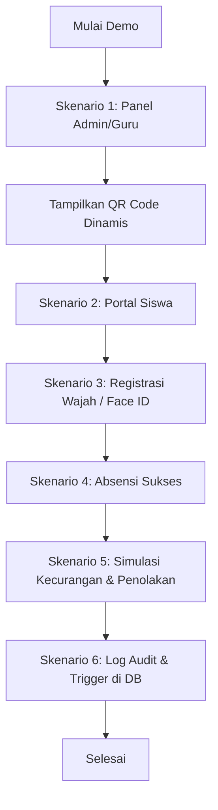

# PANDUAN SKENARIO DEMO APLIKASI: EDUATTEND (SI-ABSEN-QR)

Dokumen ini disusun untuk membantu Anda melakukan demo aplikasi **EduAttend** di hadapan dosen penguji, guru, atau audiens. Skenario demo dirancang secara berurutan agar alur presentasi terlihat profesional, terstruktur, dan menonjolkan fitur-fitur keamanan utama.

---

## 📅 DAFTAR AKUN UNTUK DEMO (SEEDED DATA)
Sebelum memulai demo, pastikan Anda menggunakan akun contoh yang sudah disediakan dari database seeder berikut:

| Peran (Role) | Email | Password | Keterangan |
|---|---|---|---|
| **Admin** | `admin@absen.com` | `password` | Akses penuh Panel Admin |
| **Guru** | `guru@absen.com` | `password` | Akses Panel Guru (Jadwal & QR) |
| **Siswa 1** | `siswa1@absen.com` | `password` | Ahmad Roni (Kelas XII RPL 1, belum ada Face ID) |
| **Siswa 2** | `siswa2@absen.com` | `password` | Siti Aminah (Kelas XII RPL 1, belum ada Face ID) |

---

## 🚶‍♂️ URUTAN LANGKAH DEMO (DEMO WALKTHROUGH)

### 🎬 Pembukaan (1 Menit)
*   **Tujuan:** Menjelaskan latar belakang & masalah utama yang diselesaikan oleh **EduAttend** (SI-ABSEN-QR).
*   **Narasi:** 
    > *"EduAttend adalah sistem absensi berbasis web yang dirancang khusus untuk meminimalisir kecurangan absensi siswa (seperti titip absen atau membagikan screenshot QR Code). Keamanan sistem ini ditopang oleh dua pilar: **Dynamic QR Code** dengan tanda tangan digital (HMAC) yang berubah setiap 15 detik, dan verifikasi wajah (**Face ID**) secara real-time di browser menggunakan TensorFlow.js."*

---

### BACAAN PENTING: ALUR SKENARIO DEMO

---

### 🟢 SKENARIO 1: Panel Admin & Guru (Filament Dashboard)
*   **Tujuan:** Menunjukkan manajemen data master dan cara guru menampilkan QR Code dinamis di kelas.
*   **Langkah-Langkah:**
    1.  Buka browser dan akses halaman login `/login`.
    2.  Masukkan email `guru@absen.com` dan password `password`. Sistem akan mengarahkan Anda ke dashboard **Filament v3** di `/admin`.
    3.  Tunjukkan secara singkat navigasi panel: **Master Data** (User, Siswa, Kelas) dan **Menu Absensi** (Jadwal Pelajaran, Absensi, Audit Logs).
    4.  Masuk ke menu **Mata Pelajaran** di sidebar.
    5.  Klik tombol hijau **"QR Absen"** pada salah satu mata pelajaran (misal: *Pemrograman Web*).
    6.  **Poin Penting untuk Dosen:** Tunjukkan bahwa QR Code tersebut **berganti otomatis setiap 5-15 detik** di layar.
        *   *Penjelasan Teknis:* QR Code digenerate menggunakan algoritma **Time-based HMAC SHA256**. Payload berisi `Jadwal ID | Jendela Waktu | Hash Tanda Tangan`. Signature ini dibuat menggunakan `APP_KEY` Laravel sehingga siswa tidak bisa memalsukan token QR.

---

### 🟢 SKENARIO 2: Portal Dashboard Siswa & Fitur Pendukung
*   **Tujuan:** Menunjukkan antarmuka (UI) reaktif dashboard siswa dan fitur ekstrakurikuler.
*   **Langkah-Langkah:**
    1.  Buka window browser baru (disarankan menggunakan mode penyamaran/incognito) agar sesi guru tidak bertabrakan dengan siswa.
    2.  Login menggunakan akun siswa: `siswa1@absen.com` (Ahmad Roni) dan password `password`.
    3.  Tunjukkan antarmuka portal siswa `/portal-siswa` yang responsif (mobile-friendly).
    4.  Jelaskan komponen dashboard:
        *   Statistik kehadiran bulan ini (Hadir, Tepat Waktu, Izin/Sakit, Terlambat).
        *   Riwayat kehadiran interaktif dengan kalender.
        *   Tab Jadwal Pelajaran hari ini dan jadwal seminggu penuh.
    5.  **Demo Many-to-Many:** Scroll ke bagian **Manajemen Kegiatan Ekstrakurikuler**.
        *   Klik tombol **"Daftar / Ikuti"** pada salah satu ekskul yang tersedia (misalnya *PMR* atau *Basket*).
        *   Tunjukkan bahwa ekskul tersebut langsung berpindah ke kolom *"Ekstrakurikuler yang Diikuti"* secara instan (berkat reaktivitas **Livewire v3**).
        *   Klik **"Keluar"** untuk mencobanya kembali.

---

### 🟢 SKENARIO 3: Pendaftaran Face ID (Registrasi Wajah)
*   **Tujuan:** Mendemonstrasikan teknologi pengenalan wajah (Face Recognition) di sisi klien.
*   **Langkah-Langkah:**
    1.  Di dashboard siswa, klik tombol biru **"Daftar Face ID"**.
    2.  Kamera depan/webcam akan menyala dan memuat model AI (tunjukkan status loading yang mulus).
        *   *Penjelasan Teknis:* Pustaka `face-api.js` dimuat menggunakan teknik *Lazy Loading* (baru diunduh ketika tombol diklik) dan *Parallel loading* menggunakan `Promise.all` untuk menjaga performa loading website agar tetap ringan.
    3.  Hadapkan wajah Anda ke kamera. Saat wajah terdeteksi, kotak pelacak (bounding box) akan muncul di layar.
    4.  Klik tombol untuk menyimpan/mendaftarkan wajah.
    5.  Sistem akan mengekstrak **128-dimensional face descriptor vector (embedding)** dan menyimpannya ke database siswa.
    6.  Tunjukkan pesan sukses: *"Face ID berhasil didaftarkan!"*.

---

### 🟢 SKENARIO 4: Proses Absensi Sukses (QR Scan + Face ID)
*   **Tujuan:** Menunjukkan alur kehadiran utama yang aman dan cepat.
*   **Langkah-Langkah:**
    1.  Pada dashboard siswa, klik tombol **"Scan QR Code"**.
    2.  Arahkan kamera siswa ke layar guru yang sedang menampilkan **QR Code Absen** (dari Skenario 1).
    3.  Kamera akan memindai QR Code, memvalidasi isinya, dan secara simultan kamera depan akan memindai wajah siswa.
    4.  Sistem menghitung kecocokan wajah menggunakan algoritma **Euclidean Distance** antara wajah hasil scan teranyar dengan wajah yang terdaftar di database.
        *   *Penjelasan Teknis:* Jika jarak Euclidean $\le 0.6$, sistem menganggap wajah cocok.
    5.  Pencatatan kehadiran sukses! Tunjukkan pesan: *"Absensi Berhasil! Anda tercatat Hadir pada pelajaran Pemrograman Web."*

---

### 🔴 SKENARIO 5: Uji Coba Keamanan & Anti-Kecurangan (Paling Disukai Penguji)
Ini adalah sesi pembuktian kepada dosen bahwa sistem Anda **tidak dapat dicurangi**.

#### Uji Kasus A: Deteksi Wajah Berbeda (Titip Absen)
1.  Buka modal scan absensi di portal siswa.
2.  Arahkan kamera ke QR Code guru, namun **hadapkan wajah orang lain** (atau tutup wajah Anda sebagian, atau gunakan foto wajah orang lain).
3.  Sistem akan menghitung jarak Euclidean. Karena hasilnya $> 0.6$, sistem akan langsung **MENOLAK** absensi dengan pesan: *"Absensi Gagal: Wajah tidak cocok dengan Face ID terdaftar."*

#### Uji Kasus B: QR Code Kedaluwarsa (QR Code Sharing / Screenshot)
1.  Guru menampilkan QR Code di layar.
2.  Ambil tangkapan layar (screenshot) QR tersebut dengan HP Anda.
3.  Tunggu selama lebih dari **30 detik** (hingga jendela waktu QR di layar guru telah berganti 2 kali).
4.  Coba pindai screenshot QR lama tersebut menggunakan kamera siswa.
5.  Sistem akan memecah token, mendeteksi perbedaan waktu, dan menampilkan pesan: *"QR Code sudah kedaluwarsa. Silakan scan QR Code terbaru dari layar guru."*

---

### 🟢 SKENARIO 6: Log Audit Real-Time & Trigger Database
*   **Tujuan:** Membuktikan integritas data dan pemanfaatan fitur database lanjutan (Stored Procedure & Trigger).
*   **Langkah-Langkah:**
    1.  Kembali ke browser yang menampilkan akun **Guru/Admin** di `/admin`.
    2.  Masuk ke menu **Absensi** di sidebar. Tunjukkan bahwa baris absensi siswa tadi telah tercatat sebagai **Hadir**.
    3.  Buka menu **Audit Logs** di sidebar. Tunjukkan log paling baru.
        *   Anda akan melihat catatan seperti: `Siswa ID 1 Sukses Scan Absen.`
        *   *Penjelasan Teknis:*
            1.  Pencatatan absensi di Laravel memanggil **Stored Procedure** `sp_catat_absen_qr` di MySQL untuk kecepatan transaksi database.
            2.  Setelah data absensi masuk, **Database Trigger** `tr_after_insert_absensi` secara otomatis menyisipkan log audit tersebut tanpa perlu ditulis manual di kode PHP backend. Hal ini menjamin keamanan audit log meskipun data diakses di luar framework.

---

## 💡 TIPS SUKSES SAAT PRESENTASI & TANYA JAWAB
1.  **Gunakan 2 Browser Berbeda:** Gunakan browser Google Chrome biasa untuk Panel Guru/Admin, dan mode Incognito atau browser Firefox/Edge untuk Portal Siswa. Ini memudahkan Anda berganti peran saat demo tanpa perlu log out berulang kali.
2.  **Siapkan Webcam Tambahan:** Jika demo dilakukan secara luring, pastikan kamera laptop Anda bersih agar proses pendeteksian wajah dari `face-api.js` berjalan lancar dalam hitungan milidetik.
3.  **Tegaskan Efisiensi Database:** Jelaskan bahwa penggunaan *Stored Procedure* dan *Trigger* memindahkan logika pencatatan dan logging langsung ke database engine (MySQL), sehingga beban server web (PHP) menjadi lebih ringan dan performa aplikasi menjadi jauh lebih responsif.
